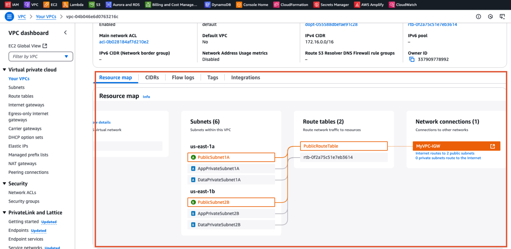

# Secure Two-AZ VPC with CloudFormation

CloudFormation templates for a VPC with public, app, and data subnets across two Availability Zones, a bastion host, and security-group-restricted access. Separate templates cover an Application Load Balancer, an Auto Scaling group, RDS, S3, and IAM.

**Status:** Partly deployed (verified 2026-09-24). `vpc.yaml` was deployed and verified (screenshot below), then torn down. `iam.yaml` is live. There's no retained evidence for the other templates.
**Scope:** Personal hands-on AWS project, Dec 2024 – Mar 2025



_Deployed `vpc.yaml` in the AWS console: 6 subnets across `us-east-1a` and `us-east-1b`, one public route table to the internet gateway, and "0 private subnets route to the Internet"._

## What this demonstrates

- **Two-AZ network design:** `172.16.0.0/16` split into six /24 subnets, one public, one app, and one data subnet in each AZ. AZs are resolved at deploy time with `!GetAZs`, not hard-coded.
- **Private subnet isolation:** only the two public subnets are associated with the route table that points to the internet gateway, and only they auto-assign public IPs. The app and data subnets have no internet route.
- **Bastion access restricted to one IP:** SSH to the bastion is allowed from a single /32 address.
- **Security-group chaining:** App1 accepts SSH only from the bastion's security group. App2 accepts only ICMP (ping) from App1's security group and has no key pair. Rules reference security groups, not IP ranges.
- **Load balancing across two AZs** (`ec2.yaml`): an ALB distributing HTTP traffic to two web servers, one per AZ, bootstrapped with Apache through UserData.
- **Metric-driven scaling** (`asg.yaml`): a CloudWatch CPU alarm triggers a scale-out policy on an Auto Scaling group spanning two AZs.
- **No database password in code** (`rds.yaml`): RDS generates the master password and stores it in AWS Secrets Manager.

## Templates

Each template is standalone. The network templates each create their own VPC; no template passes outputs to another.

| Template | What it creates |
|---|---|
| `vpc.yaml` | VPC, 6 subnets (2 AZs × public/app/data), internet gateway, public route table associated with both public subnets, bastion host (public subnet, AZ 1), App1 (app subnet, AZ 1), App2 (app subnet, AZ 2), 3 security groups |
| `ec2.yaml` | Its own VPC and subnets, an Application Load Balancer across both public subnets, a target group, an HTTP:80 listener, and 2 web servers (one per AZ, in public subnets) running Apache via UserData |
| `asg.yaml` | Its own VPC and subnets, a launch template (t2.micro, Apache via UserData), an Auto Scaling group (min 1 / max 3 / desired 2) across both public subnets, a CloudWatch alarm (CPU > 70%), and a simple scale-out policy (+1 instance) |
| `rds.yaml` | One single-AZ MySQL 8.0 instance (db.t3.micro, 20 GB, 7-day backups) with an RDS-managed master password in Secrets Manager |
| `s3-static.yaml` | S3 bucket with static website hosting (`index.html`) and a bucket policy granting **public read** |
| `s3-bucket.yaml` | A basic S3 bucket (name only) |
| `iam.yaml` | Demo of IAM resource types: a user with `AdministratorAccess`, a group with an inline `s3:*` policy, an EC2 role with `PowerUserAccess` plus `s3:GetObject`, and the user added to the group |

### Subnet layout (`vpc.yaml`)

| AZ | Public | App (private) | Data (private) |
|---|---|---|---|
| AZ 1 | `PublicSubnet1A` 172.16.1.0/24 | `AppPrivateSubnet1A` 172.16.2.0/24 | `DataPrivateSubnet1A` 172.16.3.0/24 |
| AZ 2 | `PublicSubnet2B` 172.16.4.0/24 | `AppPrivateSubnet2B` 172.16.5.0/24 | `DataPrivateSubnet2B` 172.16.6.0/24 |

## Deploy

```bash
# Network with bastion and private app instances (requires an EC2 key pair named "bastion")
aws cloudformation create-stack --stack-name vpc-stack --template-body file://vpc.yaml

# Load-balanced web servers
aws cloudformation create-stack --stack-name web-stack --template-body file://ec2.yaml

# Auto Scaling group
aws cloudformation create-stack --stack-name asg-stack --template-body file://asg.yaml

# Database
aws cloudformation create-stack --stack-name database-stack --template-body file://rds.yaml

# Static website
aws cloudformation create-stack --stack-name static-site --template-body file://s3-static.yaml

# IAM demo (creates admin-level principals; tear down after use)
aws cloudformation create-stack --stack-name iam-stack --template-body file://iam.yaml --capabilities CAPABILITY_NAMED_IAM
```

Tear down with `aws cloudformation delete-stack --stack-name <name>`.

## Accessing the private instances (`vpc.yaml`)

Keep the private key on your machine and jump through the bastion:

```bash
# SSH to App1 through the bastion (ProxyJump); the key never leaves your laptop
ssh -i bastion.pem -J ec2-user@BASTION_PUBLIC_IP ec2-user@APP1_PRIVATE_IP

# From App1, verify the security-group chain to App2
ping APP2_PRIVATE_IP
```

App2 has no key pair and only accepts ping from App1, so the ping confirms the security-group rules work as intended.

## Known limitations

- **Templates aren't connected.** `vpc.yaml`, `ec2.yaml`, and `asg.yaml` each create a separate VPC. `rds.yaml` deploys into the default VPC, not the data subnets.
- **Web servers are in public subnets** in `ec2.yaml` and `asg.yaml`. The Auto Scaling group isn't registered with the load balancer.
- **Scale-out only:** `asg.yaml` has no scale-in policy.
- **Database:** single-AZ, and without a DB subnet group. In a default VPC with an internet gateway, RDS defaults to publicly accessible; inbound access still depends on the default security group.
- **No NAT gateway:** private instances can't reach the internet for updates.
- **Bastion SSH source** is a hard-coded IP in `vpc.yaml`, and the **AMI ID** is hard-coded in three templates.
- **Not covered:** network ACLs, VPC flow logs, IMDSv2 enforcement, restricted egress, Parameters/Outputs, and template linting.
- **`iam.yaml`** grants broad permissions (`AdministratorAccess`, `PowerUserAccess`, `s3:*`); it demonstrates resource types, not least privilege.
- **Subnet names** in `ec2.yaml` and `asg.yaml` (`PublicSubnet2A`) don't follow the `vpc.yaml` convention.

## Next steps

- Connect the templates: one network stack exports subnet and security-group IDs; web, app, and database stacks import them.
- Move web servers into private app subnets behind the ALB, attach the Auto Scaling group to the target group, and add a scale-in policy.
- Put RDS in the data subnets with a DB subnet group and a security group that accepts MySQL only from the app tier.
- Replace the bastion with AWS Systems Manager Session Manager, and take the AMI from the SSM public parameter.
- Add `cfn-lint` in a GitHub Actions workflow.
